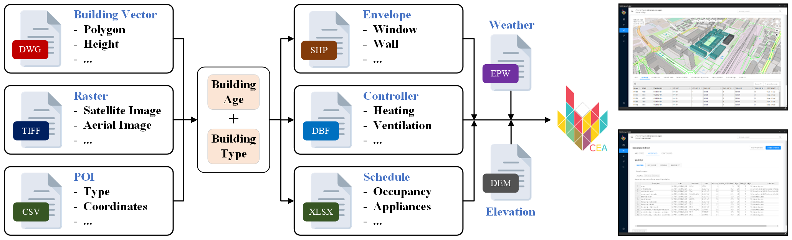
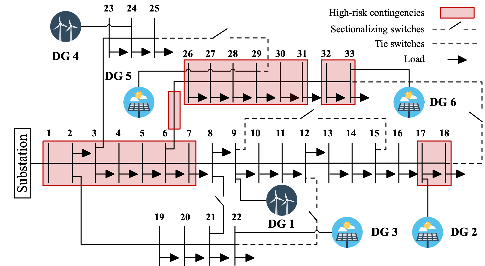

# Data Portal

A repository to share the data of my academic research papers.

## 1. AI-Powered Urban Sustainability

  
   
  <b>Workflow of urban building energy-use estimation.</b>

- **P. Liu**, Z. Wu, et al., 
"Exploiting Geospatial Shifting Flexibility of Building Energy-Use for Urban Multi-Energy System Operation,"
to be published in *Energy*. 
[[Data](https://github.com/pengxiang-liu/data-portal/tree/main/content/GIS-informed-energy-flexibility)]

## 2. Non-Convex Optimization

  
  
   
  <b>Cone-specific spatial branching.</b>

- **P. Liu**, Z. Wu, et al., 
"[Fast Resilience Assessment of Integrated Electricity-Gas Systems Considering Non-Convex Gas Flow Dynamics](https://ieeexplore.ieee.org/document/10416289/)," 
in *IEEE Transactions on Smart Grid*, , vol. 15, no. 4, pp. 3514-3527, July 2024.
[[Data](https://github.com/pengxiang-liu/data-portal/tree/main/content/SBB-for-IEGS-resilience)]

- **P. Liu**, Z. Wu, et al., 
"[Spatial Branching for Conic Non-Convexities in Optimal Electricity-Gas Flow](https://ieeexplore.ieee.org/document/9953559/)," 
in *IEEE Transactions on Power Systems*, vol. 38, no. 1, pp. 972-975, Jan. 2023. 
[[Data](https://github.com/pengxiang-liu/data-portal/tree/main/content/SBB-for-OEGF-conic)]

- **P. Liu**, Z. Wu, et al., 
"[An Improved Spatial Branch-and-Bound Algorithm for Non-Convex Optimal Electricity-Gas Flow](https://ieeexplore.ieee.org/document/9507323)," 
in *IEEE Transactions on Power Systems*, vol. 37, no. 2, pp. 1326-1339, Mar. 2022. 
[[Data](https://github.com/pengxiang-liu/data-portal/tree/main/content/SBB-for-OEGF-bilinear)]

- **P. Liu**, Z. Wu, et al., 
"[A Non-Convex and Non-Iterative Approach for Fast Vulnerability Analysis of Smart Grids](https://ieeexplore.ieee.org/document/9960551/)," 
in *2022 IEEE PES Innovative Smart Grid Technologies Conference Europe (ISGT-Europe)*, Novi Sad, Serbia, 2022, pp. 1-5. 
[[Data](https://github.com/pengxiang-liu/data-portal/tree/main/content/SBB-for-SG-vulnerability)]

## 3. Distribution System Planning and Operation

  
   
  <b>N-1 contingency screening for IEEE 33-bus distribution system.</b>

- **P. Liu**, Z. Wu, et al., 
"[Security-Constrained AC–DC Hybrid Distribution System Expansion Planning With High Penetration of Renewable Energy](https://www.sciencedirect.com/science/article/pii/S0142061522003064)," 
in *International Journal of Electrical Power & Energy Systems*, vol. 142, part B, no. 108285, Nov. 2022. 
[[Data](https://github.com/pengxiang-liu/data-portal/tree/main/content/AC-DC-planning)]

- **P. Liu**, Z. Wu, et al., 
"[A Novel Acceleration Strategy for N-1 Contingency Screening in Distribution System](https://ieeexplore.ieee.org/document/9281445)," 
in *2020 IEEE Power & Energy Society General Meeting (PESGM)*, Montreal, QC, Canada, 2020, pp. 1-5. 
[[Data](https://github.com/pengxiang-liu/data-portal/tree/main/content/N-1-contingency-screening)]
